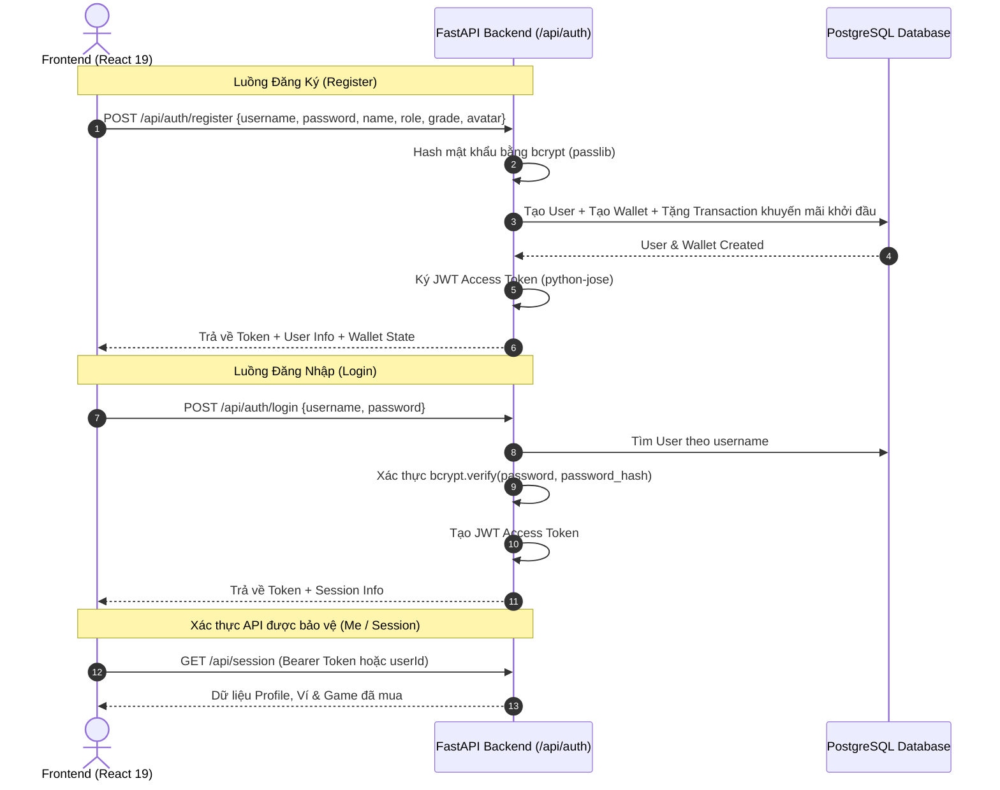

# 🌟 Kế Hoạch Triển Khai Chức Năng Đăng Ký (Register) & Đăng Nhập (Login) Lung Linh & Bảo Mật

Tài liệu thiết kế kiến trúc và kế hoạch triển khai toàn diện tính năng Đăng Ký (Register) & Đăng Nhập (Login) cho nền tảng **IQ Kid Market**.

---

## 🎯 1. Đánh Giá Hiện Trạng Hệ Thống (Review)

### Kết quả rà soát:
- ❌ **Chưa có chức năng Register / Login thật**: Hệ thống hiện tại đang sử dụng Mock Role Switcher (thẻ `<select>` ở Header) để đổi qua lại giữa 3 `userId` cứng (`u1`, `u2`, `u3`).
- ❌ **Chưa có bảng mã băm mật khẩu**: Bảng `users` trong PostgreSQL chưa có trường `password_hash`, chưa tích hợp JWT Token hoặc cơ chế xác thực phiên làm việc.
- ❌ **Chưa có Modal/Form Đăng nhập & Đăng ký**: Người dùng mới chưa thể tự tạo tài khoản riêng, chọn Avatar linh vật hoạt hình, chọn khối lớp (Lớp 1 - 9) hoặc đăng nhập lưu phiên làm việc.

---

## 🎨 2. Ý Tưởng Thiết Kế Giao Diện "Cực Kỳ Lung Linh" (Kid-Friendly & Modern EdTech)

Giao diện Auth sẽ được thiết kế theo chuẩn **Gamified EdTech**, kết hợp phong cách **Glassmorphism**, hoạt ảnh **Framer Motion**, cùng bảng màu tươi sáng kích thích tư duy của trẻ:

```
+-----------------------------------------------------------------------------------+
|  🌟 IQ KID MARKET - CỔNG VÀO THẾ GIỚI TRÍ TUỆ                                     |
+-----------------------------------------------------------------------------------+
|  [ ĐĂNG NHẬP ]  |  [ ĐĂNG KÝ THÀNH VIÊN MỚI ✨ ]                                  |
|-----------------------------------------------------------------------------------|
|                                                                                   |
|  1. CHỌN LINH VẬT ĐẠI DIỆN CỦA BẠN (Interactive 3D-Style Avatar Picker):          |
|     [ 🐯 Hổ Trí Tuệ ]  [ 🦉 Cú Logic ]  [ 🦊 Cáo Nhanh Trí ]  [ 🐼 Gấu Panda ]    |
|                                                                                   |
|  2. BẠN LÀ AI? (Visual Role Selector Cards):                                      |
|     ┌────────────────┐  ┌────────────────┐  ┌────────────────┐                    |
|     |  🎒 HỌC SINH   |  | 👩‍🏫 GIÁO VIÊN   |  |  👨‍💼 PHỤ HUYNH  |                    |
|     |  Lớp 1 -> Lớp 9|  |  Sáng tạo Game |  |  Quản lý Ví con|                    |
|     |  Tặng 90k + XP |  |  Tặng ví 500k  |  |  Tặng ví 1.000k|                    |
|     └────────────────┘  └────────────────┘  └────────────────┘                    |
|                                                                                   |
|  3. THÔNG TIN ĐĂNG NHẬP:                                                          |
|     Tên tài khoản: [ username                          ]                          |
|     Họ và tên bạn: [ Bé Thế Bình 🌟                    ]                          |
|     Mật khẩu:      [ ••••••••••                      👁️ ]                         |
|     Thanh bảo mật: [ 🟩🟩🟩🟩🟩 Siêu mạnh mẽ! 🔥       ]                          |
|                                                                                   |
|  4. TÍNH NĂNG TIỆN ÍCH CHO DEMO (1-Click Demo Login):                             |
|     ⚡ Đăng nhập nhanh tài khoản mẫu:                                             |
|     [ Bé Bình (Học sinh) ]  [ Cô Lan (Giáo viên) ]  [ Bố Dũng (Phụ huynh) ]       |
|                                                                                   |
|  [ 🚀 BẮT ĐẦU HÀNH TRÌNH KHÁM PHÁ NGAY (Nút Gradient Nổi Bật Kèm Hiệu Ứng) ]      |
+-----------------------------------------------------------------------------------+
```

### 🌈 Điểm nhấn trải nghiệm người dùng (UX Highlights):
1. **Avatar Selector tương tác**: Bộ 6 linh vật hoạt hình sinh động, bấm vào có hiệu ứng nhảy lò xo (Bounce) và phát âm thanh vui nhộn (Web Audio API có sẵn).
2. **Role Cards phát sáng (Glow Effect)**: Thẻ chọn vai trò Học sinh, Giáo viên, Phụ huynh có icon nổi 3D, mô tả quyền lợi rõ ràng.
3. **Password Strength Meter**: Thanh đo độ mạnh mật khẩu vui vẻ (Yếu ➔ Tốt ➔ Siêu cấp Pro 🔥).
4. **Header Profile Dropdown xịn xò**: Sau khi đăng nhập, Header hiển thị Avatar linh vật có vòng sáng Level, số dư ví, điểm XP và Menu thả xuống (Thông tin cá nhân, Đổi mật khẩu, Đăng xuất).
5. **Giữ phiên làm việc thông minh**: Tự động lưu Token vào `localStorage`, F5 không bị mất trạng thái.

---

## 🏗️ 3. Kiến Trúc Kỹ Thuật Backend & Bảo Mật (FastAPI + JWT + Bcrypt)



---

## 📂 4. Kế Hoạch Thay Đổi Chi Tiết Theo Từng Tệp Tin (Proposed Changes)

### 4.1 Backend (`backend/`)

#### 1. [MODIFY] `backend/requirements.txt`
Bổ sung các thư viện bảo mật và xác thực:
```diff
 fastapi==0.115.6
 uvicorn[standard]==0.32.1
 sqlalchemy==2.0.36
 psycopg2-binary==2.9.10
 pydantic==2.10.3
 python-dotenv==1.0.1
 google-genai==0.3.0
+passlib[bcrypt]==1.7.4
+python-jose[cryptography]==3.3.0
+bcrypt==4.0.1
```

#### 2. [MODIFY] `backend/app/models.py`
Thêm cột `password_hash` vào bảng `User`:
```python
class User(Base):
    __tablename__ = "users"

    id = Column(String(50), primary_key=True)
    username = Column(String(50), unique=True, nullable=False, index=True)
    password_hash = Column(String(255), nullable=True)  # Mật khẩu băm an toàn
    name = Column(String(150), nullable=False)
    role = Column(String(20), nullable=False, default="student")
    grade = Column(Integer, nullable=True)
    avatar = Column(String(50), default="smile_tiger")
    xp = Column(Integer, default=0)
    level = Column(Integer, default=1)
    streak = Column(Integer, default=0)
    created_at = Column(DateTime, default=datetime.utcnow)
```

#### 3. [NEW] `backend/app/auth_utils.py`
Module xử lý mã hóa mật khẩu và tạo JWT Token:
- `hash_password(password: str) -> str`
- `verify_password(plain_password: str, hashed_password: str) -> bool`
- `create_access_token(data: dict) -> str`
- `get_current_user(token: str) -> User`

#### 4. [NEW] `backend/app/routers/auth.py`
Các endpoints xác thực:
- `POST /api/auth/register`: Đăng ký tài khoản mới, tự cấp Ví & số dư chào mừng.
- `POST /api/auth/login`: Đăng nhập, kiểm tra mật khẩu, cấp JWT token.
- `GET /api/auth/me`: Lấy thông tin user hiện tại từ Token.
- `POST /api/auth/change-password`: Đổi mật khẩu.

#### 5. [MODIFY] `backend/app/seed.py`
Cập nhật mật khẩu mặc định (`123456`) cho 3 tài khoản demo:
- `kid_binh`: mật khẩu `123456`
- `giao_vien_lan`: mật khẩu `123456`
- `phu_huynh_dung`: mật khẩu `123456`

#### 6. [MODIFY] `backend/app/main.py`
Đăng ký router `auth.router`.

---

### 4.2 Frontend (`src/`)

#### 1. [NEW] `src/components/AuthModal.tsx`
Component Modal Đăng ký & Đăng nhập lung linh:
- Chuyển tab mượt mà giữa Đăng Nhập và Đăng Ký.
- Bộ chọn Avatar linh vật 6 icon có âm thanh hiệu ứng.
- Bộ chọn vai trò 3 thẻ (Học sinh, Giáo viên, Phụ huynh).
- Nút "Đăng nhập nhanh 1 chạm" cho 3 tài khoản demo.
- Form validation tiếng Việt thân thiện, rõ ràng.

#### 2. [MODIFY] `src/App.tsx`
- Tích hợp Auth State toàn cục (`token`, `currentUser`, `isAuthModalOpen`).
- Thêm nút `Đăng Nhập / Đăng Ký` ở Header khi chưa đăng nhập.
- Khi đã đăng nhập: Hiển thị Profile Badge sang trọng, Menu Dropdown và nút `Đăng Xuất`.
- Tự động đính kèm `Authorization: Bearer <token>` vào các request API.

---

## 🧪 5. Kế Hoạch Kiểm Thử (Verification Plan)

### A. Kiểm thử Tự động & API Backend:
1. **Kiểm tra cú pháp & cài đặt dependencies**:
   ```bash
   pip install -r backend/requirements.txt
   ```
2. **Kiểm tra API Register**:
   - Gửi request `POST /api/auth/register` với tài khoản mới `hocsinh_moi`.
   - Kiểm tra DB tạo thành công User, Hash mật khẩu, Ví khởi tạo 90.000đ.
3. **Kiểm tra API Login**:
   - Gửi `POST /api/auth/login` với pass đúng ➔ Nhận Token hợp lệ.
   - Gửi `POST /api/auth/login` với pass sai ➔ Trả về mã lỗi 401 kèm thông báo thân thiện.

### B. Kiểm thử Trực quan Giao diện (Manual UI Verification):
1. Mở giao diện trên trình duyệt (`http://localhost:5173` hoặc `http://localhost:3000`).
2. Bấm nút **"Đăng Ký Thành Viên"** ➔ Kiểm tra mở Modal lung linh, chọn Avatar có animation, đổi Role.
3. Tạo 1 tài khoản mới ➔ Kiểm tra hệ thống tự động đăng nhập, hiển thị thông báo chào mừng rực rỡ, số dư ví và XP cập nhật chuẩn xác.
4. Bấm **"Đăng xuất"** ➔ Kiểm tra giao diện quay về trạng thái Guest.
5. Thử nút **"Đăng nhập nhanh 1 chạm"** với `kid_binh` ➔ Kiểm tra đăng nhập tức thì.

---

> [!IMPORTANT]
> **Tương thích ngược 100%**: Việc bổ sung hệ thống Auth mới sẽ không làm ảnh hưởng đến các màn chơi IQ hay các Game Engine có sẵn trong dự án.
