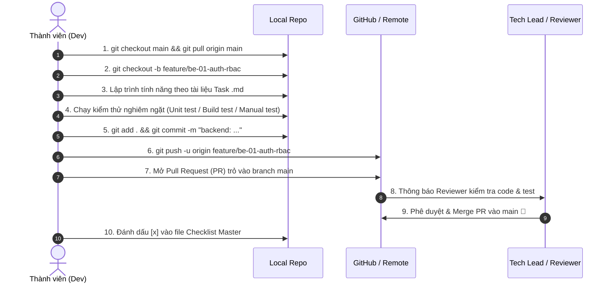

# 🌟 IQ KID MARKET — MASTER TASK CHECKLIST & QUY TRÌNH PHÁT TRIỂN DỰ ÁN

> Tài liệu này là **kim chỉ nam** theo dõi tiến độ toàn diện của dự án **IQ Kid Market**. Toàn bộ thành viên (Backend, Frontend, Fullstack, QA) bắt buộc đọc và tuân thủ các quy chuẩn trong tài liệu này trước khi bắt tay vào code.

---

## 📌 1. BẢNG TỔNG HỢP TIẾN ĐỘ TOÀN BỘ DỰ ÁN (MASTER CHECKLIST)

### ⚙️ A. BACKEND TASKS (FastAPI + SQLAlchemy + PostgreSQL + Google Gemini)

| Mã Task | Tên Nhiệm Vụ | Độ Ưu Tiên | Phụ Trách | Trạng Thái | Link Chi Tiết |
| :--- | :--- | :---: | :---: | :---: | :--- |
| **BE-01** | Hệ Thống Xác Thực & Phân Quyền Nâng Cao (Auth, JWT & RBAC) | 🔴 P0 | Antigravity | 🟢 Done | [Xem BE_01](./backend/BE_01_AUTH_JWT_RBAC.md) |
| **BE-02** | Quản Lý Ví Xu, Giao Dịch & Cổng Nạp Tiền Mô Phỏng (Wallet & Payment) | 🔴 P0 | Antigravity | 🟢 Done | [Xem BE_02](./backend/BE_02_WALLET_PAYMENT_SYSTEM.md) |
| **BE-03** | API Quản Lý Game, Levels JSONB & Hàng Đợi Kiểm Duyệt (Game CMS) | 🔴 P0 | _Chưa nhận_ | 🟡 To Do | [Xem BE_03](./backend/BE_03_GAME_CMS_LEVEL_MANAGEMENT.md) |
| **BE-04** | Pipeline Sinh Game Tự Động Bằng Google Gemini AI (AI Content Pipeline) | 🟠 P1 | _Chưa nhận_ | 🟡 To Do | [Xem BE_04](./backend/BE_04_AI_GENERATOR_GEMINI_PIPELINE.md) |
| **BE-05** | Hệ Thống Chấm Điểm, Daily Streak & Bảng Xếp Hạng (Gamification Backend) | 🟠 P1 | _Chưa nhận_ | 🟡 To Do | [Xem BE_05](./backend/BE_05_ATTEMPTS_SCORING_LEADERBOARD.md) |
| **BE-06** | API Quản Lý Khóa Học & Bài Học Kéo-Thả Scratch (Scratch Backend) | 🟠 P1 | _Chưa nhận_ | 🟡 To Do | [Xem BE_06](./backend/BE_06_SCRATCH_COURSES_LESSONS.md) |
| **BE-07** | Tích Hợp Alembic Database Migrations & Tối Ưu PostgreSQL Indexing | 🟡 P2 | _Chưa nhận_ | 🟡 To Do | [Xem BE_07](./backend/BE_07_DATABASE_MIGRATIONS_ALEMBIC.md) |
| **BE-08** | Bộ Kiểm Thử Tự Động Pytest & Thiết Lập GitHub Actions CI Pipeline | 🟡 P2 | _Chưa nhận_ | 🟡 To Do | [Xem BE_08](./backend/BE_08_TESTING_PYTEST_CI_PIPELINE.md) |

---

### 🎨 B. FRONTEND TASKS (React 19 + TypeScript + Vite + Tailwind CSS v4)

| Mã Task | Tên Nhiệm Vụ | Độ Ưu Tiên | Phụ Trách | Trạng Thái | Link Chi Tiết |
| :--- | :--- | :---: | :---: | :---: | :--- |
| **FE-01** | Tái Cấu Trúc App.tsx (3100+ Dòng) Thành Pages, Layouts & State Store | 🔴 P0 | _Chưa nhận_ | 🟡 To Do | [Xem FE_01](./frontend/FE_01_APP_REFACTOR_MODULAR_ROUTING.md) |
| **FE-02** | Hoàn Thiện UI Auth Modal, Profile 3D Avatar & Đổi Mật Khẩu | 🔴 P0 | _Chưa nhận_ | 🟡 To Do | [Xem FE_02](./frontend/FE_02_AUTH_PROFILE_USER_EXPERIENCE.md) |
| **FE-03** | Chợ Game Trí Tuệ, Bộ Lọc Đa Chiều & Mua Game 1-Chạm (Marketplace) | 🔴 P0 | _Chưa nhận_ | 🟡 To Do | [Xem FE_03](./frontend/FE_03_MARKETPLACE_STORE_CHECKOUT.md) |
| **FE-04** | Chuẩn Hóa & Mở Rộng Hệ Thống 10+ Game Engines (Math, Puzzle, UX) | 🟠 P1 | _Chưa nhận_ | 🟡 To Do | [Xem FE_04](./frontend/FE_04_GAME_ENGINES_EXPANSION.md) |
| **FE-05** | Nâng Cấp Scratch Simulator Studio Kéo Thả Khối Lệnh & Canvas Mô Phỏng | 🟠 P1 | _Chưa nhận_ | 🟡 To Do | [Xem FE_05](./frontend/FE_05_SCRATCH_SIMULATOR_STUDIO.md) |
| **FE-06** | Màn Hình Bảng Vàng Vinh Danh & Bộ Sưu Tập Huy Hiệu Gamification | 🟠 P1 | _Chưa nhận_ | 🟡 To Do | [Xem FE_06](./frontend/FE_06_LEADERBOARD_ACHIEVEMENTS_UI.md) |
| **FE-07** | Studio Sáng Tạo Game Cho Giáo Viên & Trình Sinh Game AI Trực Quan | 🟠 P1 | _Chưa nhận_ | 🟡 To Do | [Xem FE_07](./frontend/FE_07_ADMIN_CMS_STUDIO_AI_CREATOR.md) |
| **FE-08** | Tối Ưu Giao Diện iPad/Tablet, Hỗ Trợ PWA & Trình Quản Lý Âm Thanh | 🟡 P2 | _Chưa nhận_ | 🟡 To Do | [Xem FE_08](./frontend/FE_08_RESPONSIVE_PWA_SOUND_SYSTEM.md) |

---

## 🚫 2. QUY TẮC BẤT DI BẤT DỊCH VỀ GIT & BRANCHING

> [!CAUTION]
> **TUYỆT ĐỐI KHÔNG COMMIT HOẶC PUSH TRỰC TIẾP VÀO BRANCH `main`!**
> Mọi thay đổi code đều phải thực hiện qua branch riêng và tạo Pull Request (PR) để được review trước khi merge.

### 2.1. Quy ước đặt tên Branch (Branch Naming Convention)
Khi nhận một task, thành viên checkout từ branch `main` mới nhất và tạo branch theo định dạng:

- **Tính năng Backend**: `feature/be-<mã-task>-<tên-ngắn-gọn>`
  - *Ví dụ*: `git checkout -b feature/be-01-auth-rbac`
  - *Ví dụ*: `git checkout -b feature/be-02-wallet-payment`
- **Tính năng Frontend**: `feature/fe-<mã-task>-<tên-ngắn-gọn>`
  - *Ví dụ*: `git checkout -b feature/fe-01-app-refactor`
  - *Ví dụ*: `git checkout -b feature/fe-04-math-engine`
- **Sửa lỗi (Bugfix)**: `fix/be-<mã-task>-<mô-tả>` hoặc `fix/fe-<mã-task>-<mô-tả>`
  - *Ví dụ*: `git checkout -b fix/be-03-level-validation-bug`

---

### 2.2. Quy ước Commit Message (Commit Convention)
Commit message phải rõ ràng, ngắn gọn và có tiền tố phạm vi:

```bash
# Cú pháp: <loại-phạm-vi>: <nội dung tóm tắt bằng tiếng Việt hoặc tiếng Anh>

backend: bổ sung middleware kiểm tra role admin và teacher
frontend: tách Marketplace thành component riêng trong src/pages/
game-engine: bổ sung MathEngine tương tác giải toán cộng trừ
docs: cập nhật hướng dẫn API trong task BE-02
fix: sửa lỗi race condition khi mua game cùng lúc
```

---

### 2.3. Quy trình làm việc từ lúc nhận task đến khi hoàn thành (Workflow)



---

## 🧪 3. CHECKLIST KIỂM THỬ BẮT BUỘC TRƯỚC KHI TẠO PULL REQUEST (PR)

Trước khi bấm nút **Create Pull Request**, người thực hiện task **BẮT BUỘC** hoàn thành các bước kiểm tra sau:

- [ ] **Kiểm tra biên dịch & Linting**:
  - Frontend: Chạy `npm run lint` (`tsc --noEmit`) và `npm run build` không được có bất kỳ lỗi TypeScript nào.
  - Backend: Không có lỗi cú pháp Python, các import không bị circular dependency.
- [ ] **Kiểm tra tính năng thực tế (Manual Verification)**:
  - Tự mình chạy thử trên trình duyệt / Postman / Swagger UI (`http://localhost:8000/docs`).
  - Thử các trường hợp thành công (Happy Path).
  - Thử các trường hợp ngoại lệ (Edge Cases): Nhập sai mật khẩu, số dư ví không đủ, token hết hạn, chuỗi rỗng...
- [ ] **Đảm bảo không phá vỡ tính năng cũ (No Regression)**:
  - Các màn chơi Game Engine cũ vẫn chạy trơn tru (`QuestionRenderer.tsx`).
  - Tài khoản Demo (`kid_binh`, `giao_vien_lan`, `phu_huynh_dung` mật khẩu `123456`) vẫn đăng nhập và chơi game bình thường.
- [ ] **Mô tả chi tiết trong Pull Request**:
  - Tóm tắt các file đã sửa/thêm mới.
  - Đính kèm ảnh chụp màn hình UI hoặc kết quả gọi API thành công.
  - Nêu rõ có breaking change với mảng khác hay không.

---

## 📚 4. TÀI LIỆU QUY CHUẨN ĐÍNH KÈM CẦN ĐỌC

1. [GAME_ENGINE_RULES.md](../GAME_ENGINE_RULES.md): **Bắt buộc đọc** đối với bất kỳ ai sửa hoặc thêm mới Game Engine / Level.
2. [DEPLOY_LOCAL_GUIDE.md](../DEPLOY_LOCAL_GUIDE.md): Hướng dẫn cài đặt PostgreSQL, biến môi trường `.env`, Docker và lệnh Dev nhanh.
3. [PLAN_AUTH_SYSTEM.md](../PLAN_AUTH_SYSTEM.md): Kiến trúc chuẩn JWT + Bcrypt đã áp dụng cho hệ thống Auth.
